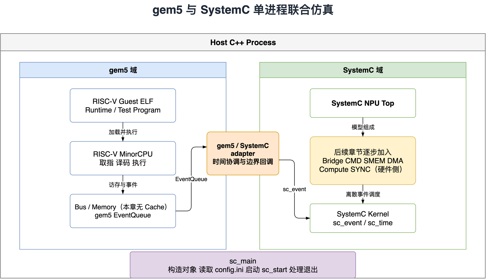

# NPU 系统建模与 gem5 + SystemC 联合仿真

[简体中文](README.md) | [English](README.en.md)

这个项目记录我搭建 NPU 系统模拟器的过程，从连接 RISC-V CPU 与 SystemC 模型开始，逐步加入数据搬运、Engine 调度和 Runtime 软件。相关内容会整理成一个[中文技术文章系列](SERIES_OUTLINE.md)。

长期目标是在模拟器中跑通一个小参数量语言模型的推理，观察软件如何映射到硬件，以及时间花在了哪些数据或资源等待上。**当前公开版本只有联合仿真基础环境，还不是能够执行计算的完整 NPU，也不是推理框架。**

公开示例采用简化参数和独立的教学 Engine。通用组件会逐步整理发布；核心计算 Engine、产品指令编码、硬件专用性能参数和内部测试资产不在公开范围内。

## 系统架构

Host 是链接 `libgem5` 的 C++ 程序，由外部 Accellera SystemC 内核运行。上游 `gem5_within_systemc` adapter 负责协调 gem5 主事件队列与 SystemC 的时间。



- **Guest：** 由 gem5 CPU 模型在系统调用仿真（SE）模式下执行的 RISC-V ELF，不启动 Guest Linux 内核。
- **Host：** 在本机运行的 C++ 程序，以 `sc_main` 为入口，创建模型并运行仿真。
- **Adapter：** 在同一进程中协调两个事件调度器。两边的时间单位均为 1 ps，这不是固定仿真步长，也不是 CPU 时钟周期。
- **SystemC 侧：** 当前只有时钟和计数模块，图中黄色的 NPU 模块将在后续加入。

第一章使用 RISC-V MinorCPU、总线和基础 DDR3 内存配置，没有配置 CPU cache，也不涉及 RVV 工作负载、自定义 NPU 指令、DMA 或 HBM。

## 已验证的范围

两个公开 C++ 示例已在 macOS arm64、SystemC 2.3.4 环境中重新编译并测试。gem5 可执行文件和共享库复用了本机已有的 25.1.0.1 构建，其源码树包含本地扩展。

| 检查项 | 验证结果 |
| --- | --- |
| 独立 SystemC 示例 | 观察到八个时钟上升沿，仿真在 7 ns 结束 |
| RISC-V Hello World | Guest 在独立 gem5 和联合仿真 Host 中均正常退出 |
| Host 退出 | 检查退出原因和退出码，退出时 gem5 与 SystemC 时间戳一致 |
| 错误路径 | 正确处理一个 tick 的时间上限、非法上限和缺失参数 |

**使用仓库脚本从官方干净源码开始的完整构建尚未完成端到端验证，Linux 构建也尚未验证。** Hello World 通过不代表 RVV 执行、双向 Bridge 时序或 NPU 性能已经验证。依赖来源、已知警告和待验证事项见[验证记录](docs/VALIDATION.md)。

## 构建并运行第一章

下面是公开示例的构建流程，验证范围以上述说明为准。命令均在仓库根目录运行。

### 环境依赖

| 依赖 | 目标版本 |
| --- | --- |
| gem5 | `v25.1.0.1` |
| Accellera SystemC | `2.3.4`，与 Host 编译器及 C++17 ABI 兼容 |
| Python | `3.12` 或 `3.13`，包含开发文件和 `venv` |
| SCons | `4.10.1`，由环境准备脚本安装 |
| CMake | `3.20` 或更高版本 |
| 本机编译器 | Apple Clang 或 GCC；尚未覆盖全部编译器与平台组合 |

还需要 Git、curl、tar、zlib 开发文件，以及对应平台的 [gem5 构建依赖](https://www.gem5.org/documentation/general_docs/building)。仓库脚本不负责安装系统软件包或 SystemC。

**第一章不需要玄铁或其他 RISC-V 交叉编译器。** 它直接运行 gem5 提供的预编译 Hello World ELF，路径为 `tests/test-progs/hello/bin/riscv/linux/hello`。本机 C++ 工具用于编译 Host 程序，不编译这个 Guest 可执行文件。

### 先检查 SystemC

```bash
git clone https://github.com/Ch1-n/npu-system-modeling.git
cd npu-system-modeling

export SYSTEMC_HOME=/absolute/path/to/systemc

cmake -S examples/chapter-01/systemc-hello -B build/systemc-hello
cmake --build build/systemc-hello -j4
ctest --test-dir build/systemc-hello --output-on-failure
```

独立示例输出 `PASS systemc_hello at 7 ns`。第一个上升沿发生在零时刻，因此第八个上升沿在 7 ns。

### 构建 gem5 并运行 Host

```bash
./scripts/setup_gem5.sh
./scripts/build_gem5.sh
./scripts/build_libgem5.sh
./scripts/prepare_chapter01.sh

cmake -S examples/chapter-01/gem5-systemc-host \
      -B build/gem5-systemc-host \
      -DGEM5_ROOT="$PWD/third_party/gem5" \
      -DSYSTEMC_HOME="$SYSTEMC_HOME"
cmake --build build/gem5-systemc-host -j4

./build/gem5-systemc-host/gem5_systemc_host build/chapter-01/config.ini

python3 tests/check_chapter01_host.py \
  build/gem5-systemc-host/gem5_systemc_host \
  build/chapter-01/config.ini
```

环境准备脚本会在源码树不存在时下载指定版本的 gem5；已有源码树会被复用，请确认其版本和本地补丁。脚本还会准备 Python 环境与 SCons。可以用 `PYTHON_BIN` 显式选择 Python，用 `JOBS` 控制 gem5 的编译并行度。

`prepare_chapter01.sh` 先在独立 gem5 中运行 Guest，再生成 C++ Host 使用的配置。移动仓库后应重新生成 `config.ini`，因为其中包含绝对路径。

脚本中的 `USE_SYSTEMC=n` 关闭的是 gem5 内部的 SystemC 实现。Host 单独链接外部 Accellera SystemC 库，仍然通过 adapter 进行联合仿真。

如果 SystemC 库不在默认查找的 `lib` 目录中，需要在每条 CMake 配置命令中加入 `-DSYSTEMC_LIBRARY=/absolute/path/to/libsystemc.so`，其他平台使用对应的库文件路径。Host 测试脚本为每次运行设置了 60 秒真实时间超时；Host 默认的模拟时间上限是 1 ms。

## 后续计划

目前只发布了基础环境示例，后续计划加入：

1. CPU 到 SystemC 的命令 Bridge，使用独立 Echo/Add 示例说明请求与完成语义。
2. DMA、片上存储和外存时序，包括 Ramulator2 接入。
3. 多 Engine、命令调度和同步。
4. Runtime 软件、算子执行和工作负载调度。
5. 验证、Profiling，以及小参数量语言模型的推理实验。

完整安排见[六篇系列提纲](SERIES_OUTLINE.md)。这些是后续开发目标，不是当前已经提供的功能。

## 文章与反馈

- [第一章 从零搭建 gem5 与 SystemC 联合仿真环境](docs/chapter-01-gem5-systemc-foundation.md)（中文）
- [验证记录](docs/VALIDATION.md)（中文）
- [第三方组件](THIRD_PARTY.md)

文章目前使用中文。英文 README 提供对应的项目介绍和构建入口，暂不维护全文英文译稿。配图同时保留 PNG 和可编辑的 Draw.io 源文件。

欢迎通过 [GitHub Issues](https://github.com/Ch1-n/npu-system-modeling/issues) 提问或反馈复现问题。请附上仓库提交号、操作系统与架构、依赖版本、gem5 是否包含本地补丁、执行命令及相关错误输出。发布日志前请移除私有路径或凭据信息。

`chapter-01` 标签保留首次发布快照，后续修订通过新提交记录，不移动已有标签。

## 许可证

原创代码和文档采用 [MIT License](LICENSE)。第三方项目保留各自的许可证，仓库不包含其源码树，详见[第三方组件说明](THIRD_PARTY.md)。
