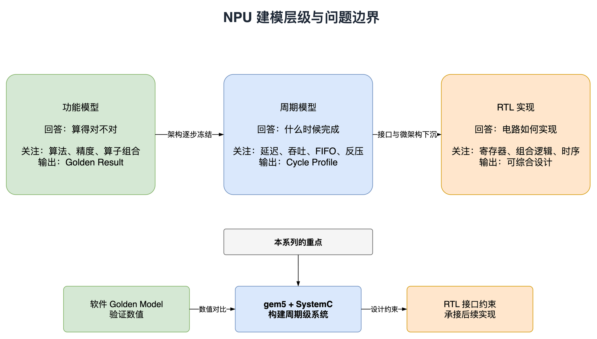
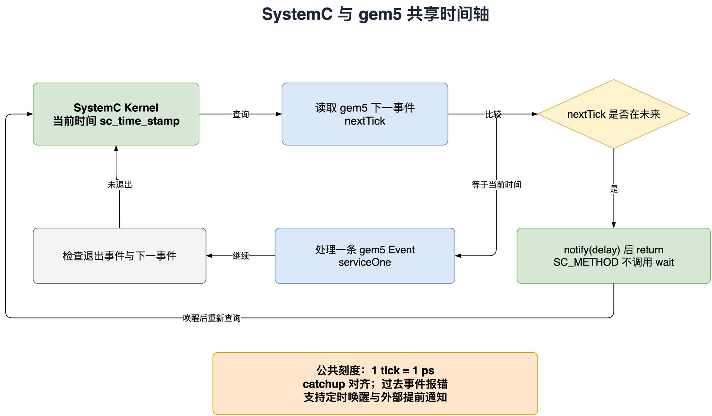
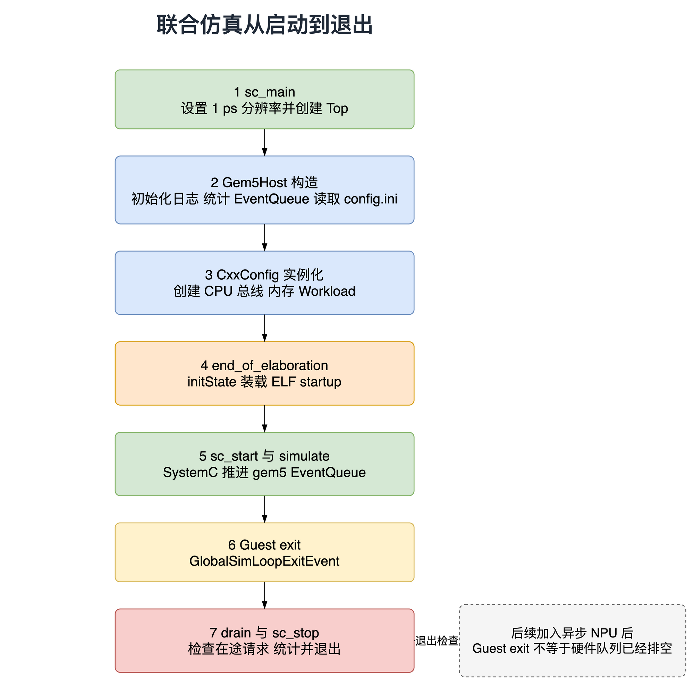

# 从零搭建 gem5 与 SystemC 联合仿真环境

> NPU 系统建模与联合仿真系列第一篇

## 1. 前言

最近搞了个 NPU 的 SystemC 模型，准备出个系列文章，把环境搭建、IP 选型、各个 NPU Engine 的 SystemC 建模、Profiling 和模型测试的过程再梳理一遍，希望能帮助对这块感兴趣的新人。不过先叠个甲，这套环境主要服务于个人的架构探索和模型验证，没有覆盖完整的工业级验证流程。这个系列就按我实际做的过程来写，也欢迎大家指出问题。

RISC-V 控制核搭配专用计算单元，是 AI 芯片中值得关注的一类架构思路。谈到实际产品，可以看看 Jim Keller 所在的 Tenstorrent 及其 Tensix 计算核心，以及国内理想的马赫 M100。这里借这些案例引出控制与专用计算相结合的思路，不表示它们采用相同的 RVV、自定义指令接口或微架构。我们这套模型采用带 RVV 扩展的 RISC-V 控制核，通过自定义指令接口与自研 Engine 交互，既让 CPU 执行控制程序和一部分通用计算，也方便逐步接入专用计算模块。

这套系统包含的各类组件如下：

带 RVV 扩展的 RISC-V 核：算是控制核心，也可以兜底通用计算。我们的重点是做 NPU 模型，所以 CPU 这块优先复用开源实现。这里采用 gem5 的 RISC-V MinorCPU，并在项目中使用 RVV、扩展自定义指令接口和寄存器交互机制。

自研 SystemC 模型：各个自研 Engine 均用 SystemC 实现。模块间的数据交互，比如 Tensor Engine 与共享存储（shared memory）之间的访问，采用 TLM 接口。

内存：完整项目使用基于 Ramulator2 的 HBM3/4 模型，按配置描述外存的命令时序和访问延迟。模型结果是否贴近目标硬件，还需要结合具体参数和验证来判断。

工具链：采用玄铁开源的 Xuantie GNU Toolchain，把 CPU 侧程序编译成 RISC-V ELF。

上面介绍的是完整项目的组成，公开示例会逐篇加入这些模块。第一篇先不接 NPU，只让 RISC-V CPU 跑一段 Hello World，同时让 SystemC 时钟正常运行。这里暂时使用基础的 DDR3 内存配置，不接 RVV 工作负载、自定义指令和 HBM。后续扩展都从这个框架往上加。配套代码在 [npu-system-modeling](https://github.com/Ch1-n/npu-system-modeling)。只想先跑起来的读者，可以直接跳到第三节；想了解两个仿真器怎样配合，再顺着往下看。

## 2. 基本介绍

### 2.1 gem5 和 SystemC 联仿

我没有找到同时满足 RVV、自定义指令接口和开源要求的现成 SystemC CPU 模型，因此选择复用 gem5 的 RISC-V CPU，再接入自己的 SystemC 模块。如果项目能拿到 CPU 厂商提供的合适模型，可以优先评估。也可以用 Verilator 将 CPU RTL 编译成带 SystemC 接口的仿真模型，不过它仍然保留 RTL 层面的实现细节，不会自动变成快速的高层模型，仿真速度和集成工作量要另外考虑。就同一进程内的结合方式而言，可以把 SystemC 接入 gem5，也可以由外部 SystemC 承载 gem5。我们主要在 SystemC 侧开发 NPU 模型，这里选择后者。

模型可以从不同角度分类。功能模型、性能模型、行为级模型，以及 cycle-accurate、bit-accurate，描述的并不是同一个维度，也不一定按顺序逐级升级。这套环境先把功能和接口跑通，再逐步加入流水、队列和访存时序；数值结果是否需要比特精确，则按具体算子的验证目标决定，功能模型也可以做到比特精确。下面的配图由 Astra 辅助绘制，用来说明不同建模层级各自适合回答什么问题。



图 1 不同建模层级回答的问题

比如说要验证 FP16 矩阵乘，功能模型可以给出参考结果，检查数据类型、舍入和计算过程是否符合预期。但如果想知道这次运算花了多少周期，就要把流水延迟、队列、存储端口和等待时间也算进去。这些是周期模型要描述的东西，本系列主要围绕周期模型展开。

SystemC 是硬件建模中常用的 C++ 类库和仿真内核，提供时钟、FIFO、事件和并发进程等机制。单个 Engine 可以由 testbench 构造请求来测试，整个 NPU 子系统也可以采用类似的方式。不过，为了把软件执行和命令提交的开销一起纳入仿真，这里让 CPU 执行程序来提交请求，复用 gem5 的 RISC-V CPU 和存储系统模型。

### 2.2 Host 和 Guest

下面这张图是整个系列的结构。黄色框里的 NPU 模块会在后续文章中逐步加入，第一篇暂时只有时钟和一个计数模块。


图 2 gem5 与 SystemC 联合仿真总体架构

图里有两种程序，编译和调试时要分清。

**Host** 是在电脑上直接运行的 C++ 程序，入口是 `sc_main`。它链接 SystemC 和 `libgem5`，负责创建模型、读取配置和启动仿真。

**Guest** 是交给模拟 CPU 执行的 RISC-V ELF。后面写的 Runtime、测试程序都属于这一侧。Host 不会直接调用 Guest 的 `main`：gem5 先装载 ELF、建立进程地址空间并初始化栈和 PC，再由模拟 CPU 取指执行。

所以，终端打印的Hello world其实是 Guest 的执行结果。

这里采用 gem5 的 SE 模式，即 syscall emulation。它能运行用户态 RISC-V 程序，把支持的系统调用交给模拟器处理，不需要先启动 Linux 内核。对于当前的实验，这样比较轻便；如果以后要研究内核驱动、中断或操作系统调度，就需要另外搭 full-system 环境。本篇也没有配置 CPU cache，先让 CPU 端口直接连接总线和内存控制器。

### 2.3 联仿策略

gem5 和 SystemC 也可以分别运行，通过 socket 或共享内存通信。不过这样还要约定两边各自能往前跑多远、消息对应哪个模拟时刻，以及什么时候停下来等对方。

这里采用 gem5 自带的 `gem5_within_systemc` 示例所使用的方式，把 gem5 编译成共享库，由外部 SystemC kernel 承载它的事件队列。最终运行的是一个 Host 进程，里面同时有 gem5 对象和 SystemC 模块：

```text
外部 Accellera SystemC kernel
        +
libgem5 C++ embedding library
        +
gem5_within_systemc adapter
```

构建时有个看起来有些反直觉的选项：这里要用 `USE_SYSTEMC=n`。它关闭的是 gem5 内部的 SystemC 实现；我们使用的 Accellera SystemC 库由 Host 单独链接，并没有把联合仿真所需的 SystemC 关掉。

这份上游 adapter 支持单个 gem5 主事件队列，整个仿真里只创建一个 `Gem5SystemC::Module`。第一篇就按这个结构来，不涉及多个 gem5 实例或并行事件队列。

### 2.4 共享时间轴

把库链接到一起之后，还有一个问题：gem5 和 SystemC 都有自己的事件调度器，究竟听谁的？

这里由 SystemC 控制外层时间。adapter 查看 gem5 队列中最早的事件，如果已经到了执行时刻，就处理它；如果还没到，就向 SystemC 安排一次定时通知，把控制权交回去。

举个例子：SystemC 当前是 10 ns，gem5 下一事件在 12 ns。adapter 会安排一个 2 ns 后的通知。期间如果 SystemC 模块在 11 ns 有事要做，内核仍会先处理它，不会因为 gem5 在等 12 ns 就跳过它。



图 3 SystemC 与 gem5 的时间协调

上游 `eventLoop()` 的主要逻辑可以缩写成下面这样。这里只保留时间判断和退出处理，完整实现见文末源码链接。

```cpp
while (!gem5_event_queue.empty()) {
    catchup();  // Align gem5's current tick with SystemC time.
    auto next = gem5_event_queue.nextTick();
    auto now = sc_time_stamp().value();
    if (next > now) {
        wakeup.notify(sc_time::from_value(next - now));
        return;  // SC_METHOD must not call wait().
    }
    if (next < now) {
        fatal("event scheduled in the past");
    }
    if (gem5_event_queue.serviceOne()) {
        exit_notification.notify(SC_ZERO_TIME);
        return;
    }
}
```

注意这里的 `return`。`eventLoop()` 是一个 `SC_METHOD`，不能在里面调用 `wait()`，而是先安排通知，再返回。等通知到来，SystemC 会重新调用它。Host 中调用 `simulate()` 的则是 `SC_THREAD`，这个线程可以等待仿真退出通知。

还有一种情况：原本打算等到 12 ns，但 SystemC 模块在 11 ns 向 gem5 插入了一个更早的事件。这时必须通过 adapter 的外部通知机制提前唤醒事件处理，重新检查队列。上游用 `externalSchedulingEvent` 处理这件事，后面写 Bridge 时还会用到。

代码里的 `catchup()` 也值得留意。在两个 gem5 事件之间，SystemC 可能已经往前走了，`gem5::curTick()` 还停留在上次处理事件的时刻。`catchup()` 把它对齐到当前 SystemC 时间。所以“共用一条时间轴”并不意味着随时读取两个时间戳，它们都恰好相等。以后从 SystemC 回调 gem5 时，也要先处理好这个对齐关系。

### 2.5 统一时间单位

这份 adapter 假定一个 gem5 tick 表示 1 ps。因为 1 秒等于 10^12 ps，Host 将 gem5 的时间基准设为 10^12 tick/s，同时将 SystemC 的时间分辨率设为 1 ps。这里的分辨率是模拟时间的最小刻度，不是固定的仿真步长；没有事件时，仿真时间可以直接推进到下一个事件。两边的时间单位对应如下：

```text
1 gem5 tick = 1 ps = sc_time_stamp().value() 的一个单位
```

这只是时间刻度，不是 CPU 或 NPU 的时钟周期。例子里的 CPU 是 1.6 GHz，对应 625 ps；SystemC 侧时钟是 800 MHz，对应 1250 ps。两个时钟都能用整数个 tick 表示，换算比较直接。

Host 在启动时会检查 SystemC 分辨率。如果它不是 1 ps，就停止运行，避免带着错误的时间单位继续仿真。同一个时间戳内部仍有 gem5 事件优先级和 SystemC delta cycle 的先后关系，这部分留到接入双向请求时再展开。

### 2.6 程序的启动和退出

接下来看代码入口。把下面这条调用顺序理清，后面遇到“对象没初始化”或“端口没接上”时，会比较容易定位。



图 4 联合仿真的启动与退出流程

在 `sc_main` 里，先设置时间分辨率，再创建时钟、计数模块和 `Gem5Host`。`Gem5Host` 继承上游的 `Gem5SystemC::Module`，构造时初始化日志、统计和事件队列，并读取 `config.ini`。

这个配置文件决定要创建哪些 gem5 对象，以及它们之间怎么连接。示例先调用 `findAllObjects()`，再逐个 `bindObjectPorts()`，最后执行 `instantiate(false)`，完成对象初始化和统计注册。这里传 `false`，是因为对象创建和端口绑定已经做过了；默认的 `instantiate()` 会把这两步也一起完成。

随后，`sc_main` 调用 `sc_start()`。SystemC 先执行 elaboration 相关回调，我们在 `end_of_elaboration()` 中调用 gem5 的 `initState()` 和 `startup()`。SE 进程在这个阶段装载 ELF、初始化地址映射、栈和 PC。接着 Host 的线程调用 `simulate()`，CPU 才开始在事件调度下执行 Guest。

Guest 退出时，gem5 返回一个 `GlobalSimLoopExitEvent`。Host 检查退出原因、退出码，以及这个时刻两边的时间是否对齐，然后调用 `sc_stop()`，最后导出统计。

这里不能只检查退出码是否为 0，因为 `simulate()` 达到时间上限时，也可能返回 code=0。示例会同时确认退出原因是最后一个 Guest 线程正常结束。

本篇还没有 NPU 请求，可以这样直接停止。后面加上 DMA 后，就要考虑另一种情况：Guest 已经退出，但最后一笔数据还没写回。这时需要先停止提交新工作，继续处理在途请求，等它们排空后再退出，也就是 drain。完成回调在此期间仍要保留，否则请求等不到响应，反而退不出去。具体实现放到后面接 DMA 时再讲。

## 3. 实例仿真

先下载仓库，后面的命令都在仓库根目录执行：

```bash
git clone https://github.com/Ch1-n/npu-system-modeling.git
cd npu-system-modeling
```

下面是示例选用的依赖版本。本机已在 macOS arm64、SystemC 2.3.4 和已有 gem5 构建上跑通；官方干净源码的完整构建、Linux 环境还没有验证完。具体进度放在仓库的 `docs/VALIDATION.md`，读者复现前可以先看一下。

| 组件 | 版本或要求 | 用途 |
|---|---|---|
| gem5 | v25.1.0.1 | RISC-V CPU 与内存系统 |
| SystemC | 2.3.4 | 外部事件内核与硬件模型 |
| Python | 3.12 或 3.13 | gem5 构建与配置脚本 |
| SCons | 4.10.1 | 构建 gem5 |
| CMake | 3.20 以上 | 构建 C++ 示例 |
| C++ 编译器 | Apple clang 或 GCC | 编译 Host |

构建前还需要准备 Python 开发文件、venv、zlib 开发文件，以及 curl、tar 等工具。仓库脚本负责下载 gem5 和准备 SCons，不代替系统包管理器。Linux 的依赖安装可参考文末 gem5 官方构建文档。

### 3.1 跑通 SystemC demo

依赖安装和编译可以借助 AI 工具，不过仍建议按下面的顺序逐步测试，出错时比较容易定位。

设置 SYSTEMC_HOME，让 CMake 找到 SystemC 的头文件和库。这里使用 SystemC 2.3.4，建议先按这个版本复现，并确保它与 Host 的 C++17、编译器 ABI 兼容。

```bash
export SYSTEMC_HOME=/path/to/systemc
```

如果用 macOS Homebrew 安装，路径可能是下面两种之一，按实际安装位置选择。Homebrew 当前默认版本不一定还是 2.3.4。

```bash
export SYSTEMC_HOME=/opt/homebrew/opt/systemc
# 或版本化目录：
export SYSTEMC_HOME=/opt/homebrew/Cellar/systemc/2.3.4
```

然后运行独立示例：

```bash
cmake -S examples/chapter-01/systemc-hello \
      -B build/systemc-hello
cmake --build build/systemc-hello -j4
./build/systemc-hello/systemc_hello
```

这个程序只观察一个 1 ns 时钟，在第八个上升沿停止。预期输出是：

```text
PASS systemc_hello at 7 ns
```

为什么是 7 ns？因为默认 `sc_clock` 在 0 ns 就产生了第一个上升沿。`dont_initialize()` 禁止的是进程初始化时的那次执行，不会屏蔽这个时钟事件。

这一步先通过，再去编译 gem5。否则后面一旦遇到链接错误，很难马上判断是 SystemC 安装问题，还是 gem5 的问题。

### 3.2 分别构建 gem5.opt 和 libgem5

这里需要两种 gem5 产物。`gem5.opt` 能运行 Python 配置脚本，用来先测试 Guest、生成配置；`libgem5_opt` 则由 C++ Host 链接。后者采用以下选项，启用 C++ 配置接口并去掉 Python 嵌入依赖：

```text
--with-cxx-config
--without-python
--without-tcmalloc
```

两种构建使用不同配置，示例将输出目录分开，避免来回切换选项导致重编译或生成文件混用：

```text
third_party/gem5/build/RISCV_OPT
third_party/gem5/build/RISCV_LIB
```

按顺序执行：

```bash
./scripts/setup_gem5.sh
./scripts/build_gem5.sh
./scripts/build_libgem5.sh
```

首次编译会比较久。之后只修改本文的 Host 或 SystemC 模型时，通常不用再编译整个 gem5。

### 3.3 生成 config.ini

平时直接用 gem5 时，可以在 Python 里创建 CPU、总线和内存控制器。我们的 Host 没有嵌入 Python，因此先用 `gem5.opt` 把这些对象及连接关系导出成 `config.ini`，再交给 C++ 配置管理器读取。

本篇配置很简单：

```text
RiscvMinorCPU
  -> SystemXBar
  -> MemCtrl
  -> DDR3 timing model
```

运行下面的脚本：

```bash
./scripts/prepare_chapter01.sh
```

它先让 `gem5.opt` 单独跑一次 RISC-V Hello World，确认 Guest 可以正常退出，再生成 Host 使用的配置。这样调试时就有了一个参照：如果单独运行 gem5 已经失败，先不用看 SystemC 侧。

`config.ini` 里含有 Guest ELF 的绝对路径。换电脑或移动仓库后要重新生成，这个文件不提交到 Git。

### 3.4 构建并运行 Host

准备好配置后，编译联合仿真程序：

```bash
cmake -S examples/chapter-01/gem5-systemc-host \
      -B build/gem5-systemc-host \
      -DGEM5_ROOT="$PWD/third_party/gem5" \
      -DSYSTEMC_HOME="$SYSTEMC_HOME"

cmake --build build/gem5-systemc-host -j4

./build/gem5-systemc-host/gem5_systemc_host \
  build/chapter-01/config.ini
```

macOS 下可能遇到一种情况：编译链接成功，启动却报找不到 `build/RISCV_LIB/libgem5_opt.dylib`。原因是某些 gem5 构建把相对路径写进了动态库 install name。示例 CMake 已在链接后调用 `install_name_tool -change` 修正这个依赖路径；Linux 使用 build RPATH 查找共享库。

### 3.5 看运行结果

本机这组配置的关键输出如下，较长的退出信息做了折行，tick 数会随版本和配置变化：

```text
Hello world!
gem5 exit: tick=127806250
  cause="exiting with last active thread context" code=0
SystemC stop: time=127806250 ps npu_clock_edges=102246
PASS gem5_systemc_host
```

第一句来自 RISC-V Guest。后面的退出信息显示，gem5 的 tick 和 SystemC 时间对得上，SystemC 侧也确实收到了时钟边沿。`npu_clock_edges` 包含 0 时刻的上升沿，只是一个观察计数，目前还没有 NPU 计算可统计。

示例默认给 `simulate()` 设置了 `10^9` tick，也就是 1 ms 模拟时间的上限。可以在命令后再传一个数字来修改它。如果传 `1`，程序应该因为达到上限而失败，不能仍然打印 PASS。仓库里的检查脚本也覆盖了这条路径：

```bash
ctest --test-dir build/systemc-hello --output-on-failure
python3 tests/check_chapter01_host.py \
  build/gem5-systemc-host/gem5_systemc_host \
  build/chapter-01/config.ini
```

模拟时间上限和我们实际等待的时间是两回事。假如 Host 自己卡在一个不让出控制权的循环里，模拟时间也可能停住，所以检查脚本另外给每个进程设置了 60 秒的墙钟超时。

到这里，验证的是 Guest 执行、两个框架的启动和退出，以及退出时的时间对齐。CPU 与 NPU 还没有交换请求，暂时也看不到带宽、计算吞吐率这些结果。下一篇接上命令 Bridge 后，才开始检查请求有没有丢失、返回时间是否正确。

## 4. 后续

这篇先把环境搭到能运行一个小程序。下一篇会加一个简单的 Echo/Add 设备，让 CPU 发出命令，SystemC 侧等若干周期后返回结果。这样就能沿着一条真实请求，看清 CPU 在哪里等待、设备何时完成，以及响应怎么送回来。

再往后是数据搬运、片上存储、多 Engine 调度和 Runtime。公开版本会逐步整理原项目里可以复用的 common 模块，核心计算 Engine 则用独立的小例子替代。希望读者最后拿到的不只是几个分散的测试，而是一套能继续添加自己模块的仿真环境。

文章正文、代码和配图放在同一个仓库里，系列提纲保存在 `SERIES_OUTLINE.md`。后续修改会保留提交记录，已经发布的章节标签也会保留，方便对照文章当时的版本。

## 5. 参考资料

1. gem5 官方仓库：[https://github.com/gem5/gem5](https://github.com/gem5/gem5)
2. gem5 `v25.1.0.1`：[https://github.com/gem5/gem5/releases/tag/v25.1.0.1](https://github.com/gem5/gem5/releases/tag/v25.1.0.1)
3. gem5 within SystemC adapter 源码：[sc_module.cc](https://github.com/gem5/gem5/blob/v25.1.0.1/util/systemc/gem5_within_systemc/sc_module.cc)
4. Accellera SystemC：[https://www.accellera.org/downloads/standards/systemc](https://www.accellera.org/downloads/standards/systemc)
5. SystemC 2.3.4 Release：[https://github.com/accellera-official/systemc/releases/tag/2.3.4](https://github.com/accellera-official/systemc/releases/tag/2.3.4)
6. gem5 构建依赖：[Building gem5](https://www.gem5.org/documentation/general_docs/building)
7. gem5 C++ 生命周期：[cxx_manager.cc](https://github.com/gem5/gem5/blob/v25.1.0.1/src/sim/cxx_manager.cc)
8. 本文配套代码、提纲与验证记录：[https://github.com/Ch1-n/npu-system-modeling](https://github.com/Ch1-n/npu-system-modeling)
