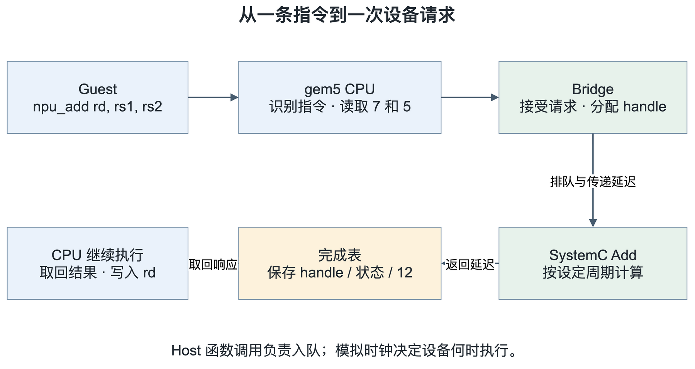
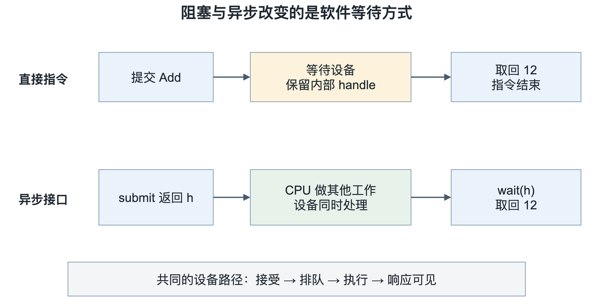
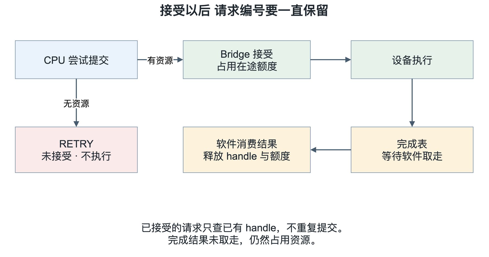
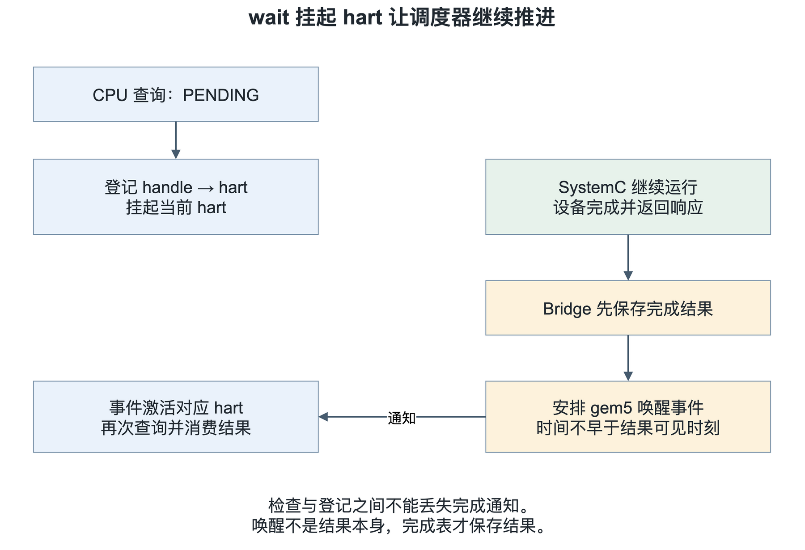

# 一条 NPU 命令
## 如何从 RISC-V CPU 走到 SystemC

> NPU 系统建模与联合仿真系列第二篇

上一篇把 gem5 和 SystemC 放进了同一个进程：RISC-V CPU 可以执行 Guest 程序，SystemC 时钟也在运行。不过，两边还没有交换数据。即使把 NPU 模型接在旁边，CPU 也不知道该怎么让它开始工作。

本篇就围绕这个问题展开，为联合仿真平台接入命令通路。先不管数据搬运，也不接功能复杂的计算 engine，我们只让 CPU 传给 SystemC 模型两个数：7 和 5，SystemC 侧过若干周期返回两数之和 12。

我们先不关注加法器本身怎么建模。试想一下：这条请求在哪个时间点算提交成功？SystemC 侧还没算完的时候，CPU 在做什么？如果队列满了，重新执行指令会不会把同一条命令发两遍？无论是最简单的加法器还是复杂的 tensor engine，这些前置问题都得先敲定。

下面我们用 SystemC 侧独立的 Echo/Add 作为例子，说明桥接思路。Echo 原样返回输入，Add 返回两个操作数之和。

## 一 CPU 到 engine 的三条下发通路

给 NPU 发命令，常见的办法是 MMIO。软件通过 load/store 访问设备寄存器，写入参数，再写一个启动位或 doorbell。CPU 仍然执行普通访存指令，设备通过地址译码接收请求。后面如果用了命令队列，软件还可以先在内存中准备描述符，最后用一次 MMIO 写通知设备去取。

命令队列是另一种思路：CPU 先在内存里准备好描述符，最后用一次 MMIO 写通知 device 去取，描述符里还可以写下一条描述符的地址，很多 DMA 和按帧处理的图像 ASIC 都支持这种链表模式。

当上面两种方式都不满足需求时，还有第三条路：自定义指令。CPU 识别出这条指令后，把相关数据和信号送到自研加速器接口。这其实就是协处理器接口，比如伯克利的 RoCC、RISC-V 社区主推的 CV-X-IF、芯来的 NICE、平头哥的 COP。对这块感兴趣的朋友可以去找这些协议的相关资料看看，这里就不展开了。“协处理器接口”描述的是 CPU 和加速器怎么连接；软件看到的可以是自定义指令，CPU 内部再通过一套协处理器请求/响应接口把工作交给 NPU。至于是否阻塞 CPU、支持多少条命令 outstanding，这些细节同样要在设计阶段定下来。

以一条概念上的 `npu_add rd, rs1, rs2` 为例，CPU 需要先识别它属于 NPU 指令，再在执行时读出源寄存器的值。假如 `rs1` 编码指向 x10，而 x10 里存的是 7，送给设备的操作数应当是 7，不是寄存器编号 10。

假如自研 NPU 和 CPU 耦合得比较紧，NPU 可以通过自己的 LSU 直接访问 CPU 的寄存器，那直接把 x10 这个寄存器号传过去也行，只是有点多此一举。当需要传递的数据量比较大时，可以考虑传起始地址。

这条指令需要两级译码：CPU 判断该走哪条接口、要读哪些寄存器；device 收到之后，再判断具体执行 Echo 还是 Add。



图 1 CPU 负责指令和寄存器语义，Bridge 保存请求，设备按模拟时间执行

图中的 Bridge 是一段 Host 侧模型代码。gem5 执行 Guest 指令时调用它，Bridge 把请求存下来，再由 SystemC 进程取走。这个 C++ 调用确实发生在同一个 Host 进程内，但它不等于“device 在零周期内完成”：函数返回只表示请求已经入队，真正的计算要等后面的时刻。这和很多带 RVV 扩展的 RISC-V 处理器是一个道理——标量核做完前置操作并 commit 之后，指令才提交到 RVV 流水线开始计算。

## 二 RISC-V 自定义扩展指令

前面写的 `npu_add` 只是一个便于阅读的名字。把它原样放进汇编文件，工具链并不会自动知道这是什么指令。我们得先约定它对应哪 32 个比特，再让 Guest 的汇编器和 gem5 的译码器按同一份约定工作。

### 编码空间：custom-0 到 custom-3

RISC-V 为自定义指令留了 `custom-0` 到 `custom-3` 四个 major opcode，7 位编码分别是 `0x0B`、`0x2B`、`0x5B` 和 `0x7B`。规范将它们留给非标准扩展，避免与未来标准扩展占用同一编码。不过，同一个系统里的不同厂商扩展仍然可能互相冲突，不能认为用了 custom 空间就能随意组合。

这套公开示例先使用 RV64 和 `custom-0`，借用 R 型指令的字段布局：

| 位范围 | 字段 | 在本例中的用途 |
| --- | --- | --- |
| 31:25 | funct7 | 区分 Echo 和 Add |
| 24:20 | rs2 | 第二个源寄存器编号 |
| 19:15 | rs1 | 第一个源寄存器编号 |
| 14:12 | funct3 | 选择阻塞式标量操作组 |
| 11:7 | rd | 结果写入的目标寄存器编号 |
| 6:0 | opcode | `0x0B`，即 custom-0 |

字段名沿用了 R 型格式，但字段含义由我们定义，不是把标准 ADD 指令换个名字。先只给两条阻塞式指令分配编码，足够把命令通路接起来：

| 教学助记符 | opcode | funct3 | funct7 | 操作数与结果 |
| --- | --- | --- | --- | --- |
| npu_echo | 0x0B | 0 | 0 | rs1 的值原样写入 rd，rs2 编码固定为 x0 |
| npu_add | 0x0B | 0 | 1 | rs1 与 rs2 的值相加，低 64 位写入 rd |

这两条指令都要等 device 返回后才算完成。没有资源时先等待重试，不能把“暂时排不上队”当成计算结果。

本例未定义的字段组合，包括 Echo 的 rs2 非零，应走非法指令路径，而不是随便当成 Add。设备错误则不能伪装成正常的 64 位数返回；最小示例会将其作为明确的仿真失败，面向实际软件的异常机制需要另行扩展。本文这套编码不对应原工程的产品 ISA，也不是 RISC-V 官方定义的 NPU 扩展。

### Guest 侧的指令发射

在支持 RISC-V `.insn` 的 GNU 汇编器中，可以直接按格式给出字段。下面让 x10 和 x11 提供输入，把结果写入 x12：

```asm
li a0, 7
li a1, 5
.insn r 0x0b, 0, 1, a2, a0, a1
```

`.insn r` 后面依次是 opcode、funct3、funct7、rd、rs1、rs2。这里 a0、a1、a2 分别是 x10、x11、x12 的 ABI 名称。这条自定义指令编码为 `0x02B5060B`；在小端 ELF 的指令字节中可以看到 `0B 06 B5 02`。

写 C 测试程序时，可以用一个小封装把这行汇编藏起来：

```c
#include <stdint.h>

static inline uint64_t npu_add(uint64_t a, uint64_t b)
{
    uint64_t result;
    __asm__ volatile (
        ".insn r 0x0b, 0, 1, %0, %1, %2"
        : "=r" (result)
        : "r" (a), "r" (b)
    );
    return result;
}
```

`"r"` 让编译器把输入放进通用寄存器，`"=r"` 表示输出由这段汇编写入。这样不用手工指定 a0、a1，也不会和编译器自己的寄存器分配打架。输入寄存器与输出寄存器允许重叠，因为这条指令先取得两个输入，再在完成时写回结果。

`volatile` 用来避免这段带设备副作用的汇编仅因结果没用就被优化掉，它不等于内存屏障。本例只传标量、不访问 Guest 内存，所以没有添加 `"memory"` clobber。以后改为提交描述符地址时，既要考虑编译器重排，也要定义 CPU 与设备之间的内存顺序；只加一个 clobber 并不能解决 DMA 可见性问题。

工具链能生成这 4 个字节，只说明 Guest 已经把指令发出来了。在不支持它的 CPU 或未修改的 gem5 上运行，仍然会遇到非法指令。反汇编器不认识新助记符也不奇怪，核对原始编码比看它是否打印 `npu_add` 更可靠。

### gem5 侧的译码接入

接下来在 gem5 的 RISC-V ISA 描述中加入匹配逻辑。下面写的是原始指令字段的逻辑关系，不是可以直接粘贴进 `decoder.isa` 的语法：

```text
if raw_opcode == 0x0B and funct3 == 0:
    if funct7 == 0 and rs2_index == 0:
        构造 NpuEcho 指令对象
    else if funct7 == 1:
        构造 NpuAdd 指令对象
    else:
        非法指令
```

这里有个容易看漏的细节：gem5 的 ISA 描述可能已经单独译码了最低两位，内部名为 OPCODE 的字段不一定包含原始指令的全部 7 位。若当前分支使用的是 bits[6:2]，`custom-0` 对应的 case 就是 `0x02`，而不是 `0x0B`。修改前要对照字段定义和外层译码，不能照着名字填数字。

译码阶段生成的是指令对象，寄存器里的 7 和 5 要到执行阶段才能读取。指令描述还要声明源、目标寄存器，让 CPU 模型知道数据依赖；随后由执行逻辑读操作数、调用 Bridge、等待完成并写回 rd。直接绕过这套机制去读写寄存器，会让时序 CPU 的相关性处理失去依据。

### 阻塞接口与异步接口

Echo、Add 描述设备做什么；submit、poll、wait 描述软件怎么提交工作、怎么取得完成信息。两者不是同一层次。前两条阻塞指令把提交和等待包在一起，软件只拿到最终值。后面拆成异步接口时，submit 先返回 handle，软件可以继续工作，再通过 poll 或 wait 取得结果。

本文先给阻塞路径一个确定的编码，异步部分只保留接口伪代码，不急着把每个 API 都分配成一条指令。尤其是后文的完成对象里既有 status 又有一个完整的 64 位 value，不能理所当然地认为可以同时塞进一个 rd，也不能随便占用结果最高几位当状态。异步 ABI 得另想办法，比如把查状态和取结果分开，或者返回完成记录的地址；方案定下来之后，结果消费规则也要跟着调整。这一步会放到后面联调时落实。

## 三 Add 的阻塞式往返

最容易理解的接口是阻塞式的：CPU 发出 Add，等结果回来，再把 12 写入目标寄存器，继续执行下一条指令。为了不被数据宽度分散注意力，这里约定 Add 对两个 64 位无符号数相加，溢出按模 2 的 64 次方回绕。

Bridge 收到请求时，为它分配一个请求编号，后面简称 handle。这个编号只用来关联请求和响应，不是计算结果。CPU 侧保存“当前这条指令正在等待哪个 handle”，设备侧则带着它完成运算。

这份待完成记录很重要。gem5 里的指令执行逻辑可能在等待后再次进入。如果每次进入都重新调用 submit，原本的一条 Add 就会变成多条设备请求。

```text
execute_direct_add(hart, instruction):
    if hart 没有待完成请求:
        reply = try_submit(ADD, value_rs1, value_rs2)
        if reply 是 RETRY:
            return 等待重试
        保存 instruction 与 reply.handle

    result = wait_or_take(已保存的 handle)
    if result 是 PENDING:
        return 继续等待

    按 result.status 处理成功或错误
    成功时把 result.value 写入 rd
    清除待完成记录
    return 本条指令完成
```

第一次因为队列满而失败，和已经提交成功、正在等结果，是两种不同状态。前一种还可以提交；后一种只能查询已有 handle。待完成记录还应当和 hart、当前指令对应起来，不能让另一个执行上下文误取结果。

在现有模型中，直接指令路径通过保留 PC、后续重新进入执行逻辑来等待结果。这是一种模拟实现办法，不能据此声称已经准确建模了乱序核的 ROB 退休行为。重入尝试是否影响指令计数、异常如何处理，都还取决于 CPU 模型。本文先讨论请求接口，不把“PC 最后前进了”当成退休语义已经验证的证据。

还有一个边界需要放在 CPU 侧：提交设备请求是有副作用的。若在错误的推测路径上把命令发出去，CPU 后来清空流水线，也不会自动收回设备已经做过的事。因此，自定义指令需要限制在合适的非推测执行位置提交，或另行实现取消协议；不能只加一段译码就算接完。

## 四 提交与结果返回

阻塞接口适合把第一条请求看明白，但 NPU 命令往往要执行很久。CPU 可以先准备下一批参数，也可以提交其他工作，没必要总停在原处。

这时把提交和取结果拆开：submit 返回 handle，poll 查询这个 handle，wait 在结果还没准备好时挂起当前 hart。Guest 看到的用法大致如下：

```text
h = submit_add(7, 5)       // 实际接口还要处理 RETRY
prepare_next_job()
r = wait(h)
assert(r.status == OK && r.value == 12)
```

这里返回给软件的第一个值是 handle，不是 12。提交指令在成功接受后就可以结束，等待结果的责任转移给后面的 poll 或 wait。相比之下，上一节的直接指令把 handle 留在 CPU 模型内部，不暴露给软件，一直等到结果可用才结束这一操作。



图 2 设备处理流程可以相同，差别在于软件何时得到控制权和结果

为了避免接口歧义，本文约定 poll 在结果未就绪时返回 PENDING；一旦返回完成结果，就同时消费这条响应，释放 handle 对应的资源。wait 使用同一套取结果规则，只是在未完成时不让 Guest 持续轮询。同一 handle 被成功取走后，再查询应当报 INVALID_HANDLE，而不是再次返回 12。

也可以设计一个不消费的 peek，再单独提供 take。两种都能用，但名字叫 poll 并不能保证它没有副作用。软件和 Bridge 必须遵守同一份约定，否则很容易出现“前面打印状态时把结果取走了，后面的 wait 却一直在等”的问题。

对完成项的查询和消费还需要检查归属。本篇先按每个 handle 只有一个拥有者、一个消费者处理；跨 hart 分享结果需要额外协议，不能靠大家都知道编号来实现。

## 五 队列反压与责任边界

先看请求被接受的那个瞬间。提交前，CPU 负责保存操作数并决定是否重试；提交成功后，Bridge 就有责任保留它，直到得到一个可以交还的终态结果。这个责任不能随着某个 FIFO 出队就消失。

所以 `try_submit` 最好给出明确的两类结果：接受成功，返回有效 handle；暂时没有资源，返回 RETRY。暂时拒绝时不能暗中已经入队，否则 CPU 下一次重试就会重复执行。指令本身不合法则应返回错误或触发约定的异常，不能伪装成 RETRY 一直等下去。



图 3 出队不是请求结束，结果被消费以后才能回收对应资源

请求队列不是唯一会满的地方。假设 CPU 连续提交很多条命令，却迟迟不取结果：设备虽然都算完了，完成表仍会逐渐占满。只限制请求 FIFO 深度，并不能限制系统里尚未回收的请求总量。

一个适合最小示例的办法，是给在途请求设置总额度。提交成功时占用一个额度，同时为最终完成信息保留空间；结果被软件消费后才归还额度。这样即使软件暂时不取结果，已经接受的请求也有地方留下完成状态。请求 FIFO 的深度则单独决定有多少条命令可以排队等设备。

如果采用其他队列组织方式，也要把返回路径的背压接完整。完成缓冲满了，Bridge 就不能继续无条件读取设备响应；设备可能因此暂停输出。不能为了让流水继续跑，覆盖旧结果或丢掉响应。

这套设计仍然要求软件最终消费结果。软件只提交不回收，系统停止接受新请求是合理的资源耗尽现象，不应指望增加一点队列深度就解决。后面做 Runtime 时，需要明确由谁负责回收每一条完成项。

handle 的复用也要小心。旧编号刚释放就分给新请求，迟到的一次查询可能误认成新结果。可以用带代际信息的 handle，或者足够宽的单调编号并定义回绕规则。只给请求标一个整数，还不等于生命周期已经管好了。

## 六 延迟分段与 ready_cycle

回到 Add。Bridge 接受请求以后，要等请求侧的传递延迟，再把它送给设备；设备按设定延迟完成计算；响应经过返回侧延迟，才对 CPU 可见。

这里至少能区分四个时刻：接受、设备完成、响应可见、软件消费。设备刚算出 12，不代表 CPU 同一时刻就能读到；CPU 已经能够读到，也不代表软件已经执行到 wait。

模型中可以给请求记录一个 `ready_cycle`。SystemC 时钟进程只有在当前周期达到这个值，并且下游有空间时，才转发请求。返回路径也用相同思路保存延迟中的响应。这样队列等待与传递延迟就能区分开：即使已经过了规定的延迟，下游满了仍然不能发送。

CPU 与 NPU 不同频时，这种按目标时钟边沿加延迟的方式，可以表达抽象的跨时钟域传递开销。但它没有模拟亚稳态，也不等于实现了 RTL 异步 FIFO。具体延迟是否包含第一个采样边沿，需要在代码与测试中采用一致定义，否则很容易差一个周期。

尤其不要在 Host 回调里写一个 `while (!done)` 忙等，再指望 SystemC 自己把计算跑完。这里两个模拟器靠协作调度推进，当前调用不返回，负责产生 done 的进程可能根本拿不到执行机会。Host 的 `sleep` 也只是让真实电脑等一会儿，不会替设备推进若干模拟周期。

正确的做法是留下待完成状态，然后把控制权交还调度器。SystemC 到达相应时刻后更新结果，CPU 再在自己的事件中继续执行。

## 七 挂起与唤醒

轮询很好理解：CPU 不断执行 poll，每次问“好了没有”。它会产生真实的模拟指令开销，但大量空转也可能不是我们希望研究的软件行为。wait 则可以让当前 hart 在没有结果时暂停，把执行机会留给其他事件。



图 4 先保存结果，再通知 CPU；唤醒以后仍需重新检查并取走结果

CPU 侧先查完成表。如果没有结果，就登记“这个 hart 正在等这个 handle”，然后挂起该 hart。注意是挂起模拟 CPU 的执行上下文，不是把整个 Host 线程阻塞在某个条件变量上。

设备响应到达 Bridge 后，Bridge 先把结果放进可查询的完成表，再安排 gem5 唤醒事件。事件的时间不能早于响应可见时间，也不能排进 gem5 已经走过的过去。事件执行时重新确认等待关系，再激活对应 hart。适配层同时需要得到通知，以便及时处理新加入的 gem5 事件。

这里没有 Linux 中断处理程序。我们仍处于 SE 模式，唤醒是模拟器内部对 ThreadContext 的操作。将来接操作系统驱动和硬件中断，需要另外建模中断控制器和软件处理路径。

为什么强调“先保存，再通知”？因为通知只表示可以再查一次，不应该承担保存结果的责任。如果通知先到，CPU 醒来却读不到响应，可能再次睡下；而真正的结果随后写入时，没有第二次通知，它就再也醒不过来了。

另一个危险窗口在检查与睡眠之间：CPU 刚查到 PENDING，响应就到了，但等待者尚未登记。正确实现需要把检查、登记、挂起当成一个受保护的过程，或在登记后再次检查结果。在单线程、协作调度且这几步之间不让出控制权的实现中，可以利用该执行约束；一旦改成多个 Host 线程，就必须重新处理同步问题。

醒来以后也不能直接默认成功。CPU 应当重新检查 handle，并按状态取得结果。请求可能正常完成，也可能以设备错误结束；对软件来说，两者都是需要消费的终态，而 PENDING 才表示还要继续等待。

## 八 后续--待定约定

Echo/Add 只传两个标量，暂时没有内存可见性的问题。如果以后传的是描述符地址，`rs1` 里的值就只是地址，描述符本体还要经过访存取回。不能把 Guest 地址当成 Host 指针直接解引用，否则就绕开了地址转换、延迟和存储系统。下一篇接 DMA 时会处理这些问题。

向量命令也不能仅靠两个标量值表达完整语义。操作可能依赖 VL、VTYPE、mask 和向量寄存器内容。哪些信息在提交时快照，谁负责读写向量寄存器，什么时候解除相关依赖，都要单独约定。普通 RVV load/store 访问存储系统的路径，与协处理器命令提交路径也要分开看，不能因为最终访问同一个片上存储，就全部塞进命令 Bridge。

异常和退出同样会影响请求归属。软件 wait 超时，只代表它不愿再等，并不自动取消设备已经接受的请求。要支持取消，需要定义哪些阶段能取消、取消结果如何返回。否则仍要有人回收后续完成项。

结束仿真前也不能只看请求 FIFO 空了没有。命令可能正在设备里执行，响应可能还在传递，CPU 可能仍然挂起。drain 要检查这些状态，并约定未消费的完成项怎么办。最小示例可以要求 Guest 取完所有结果再退出；后面支持更复杂的软件时，再补退出清理策略。

这些约定最终要落成测试。除了验证 `7 + 5 = 12`，我会优先检查几个边界：把队列压满，看拒绝的请求有没有被偷偷执行；让 CPU 多次进入等待逻辑，看设备是不是只收到一条命令；故意延后取结果，看响应会不会覆盖；让完成恰好落在 wait 附近，看 hart 能否继续运行。记录 handle 和接受、发出、完成、可见、消费的时间，就能把问题定位到具体一段。

到这里，我们通过一条自研的 Add 指令展示了协处理器接口中需要考虑的各种点。它不设计 NPU 的复杂计算，但能帮我们先确定三件事：软件交出去的工作有人接，device 完成的结果有人收，等待也不会把整个仿真卡住。接下来把 DMA 加进来，才有基础讨论“计算还没开始，数据究竟卡在哪里”。我们下个章节见，将继续讨论数据流相关问题。

## 九 仿真流程

把前面的模块串起来，运行时可以按下面的顺序理解：

1. 先生成一个包含 `npu_add` 的 RISC-V Guest ELF。这个 Demo 的指令字节是 `0x02B5060B`，用于验证自定义编码没有在进入 gem5 前就被工具链改错。
2. 用 `gem5.opt` 执行配置脚本，生成 CPU、内存和 Guest 的 `config.ini`。Host 版本不再嵌入 Python，因此把这一步和实际联合仿真分开。
3. `sc_main` 设置 SystemC 时间分辨率，创建 NPU 时钟、Echo/Add 设备和 `Gem5Host`，再由外部 SystemC kernel 启动整个进程。
4. gem5 取指并按 `custom-0` 的字段译码。`npu_add` 调用 Host 注册的 Bridge 回调，把两个标量写入 SystemC FIFO；回调挂起 gem5 事件线程，SystemC Engine 等待 3 ns 后返回结果，再恢复指令执行并写回 `rd`。
5. Guest 将写回的 `a2` 作为退出码，Host 同时检查设备完成记录、gem5 的退出原因和结果，最后统一停止仿真。

因此，这一版 Demo 已经把同一条 Guest 指令真正连接到了 SystemC 设备：`Guest 指令 -> gem5 译码与执行 -> Bridge -> SystemC Engine -> Bridge 回调 -> gem5 写回 -> Guest 退出`。这里的 Bridge 仍是进程内教学实现，后续可以在不改变这条时序关系的前提下替换成更接近真实 NPU 的队列、TLM 或寄存器接口。

## 参考资料

1. RISC-V 非特权 ISA 规范及自定义编码空间：[riscv-isa-manual](https://github.com/riscv/riscv-isa-manual)。本文使用独立的教学编码，不是标准 NPU 指令。
2. gem5 RISC-V 指令译码入口：[decoder.isa](https://github.com/gem5/gem5/blob/v25.1.0.1/src/arch/riscv/isa/decoder.isa)。NPU 路径需要本地扩展，不是上游已有功能。
3. gem5 执行上下文接口：[thread_context.hh](https://github.com/gem5/gem5/blob/v25.1.0.1/src/cpu/thread_context.hh)。
4. gem5 事件队列：[eventq.hh](https://github.com/gem5/gem5/blob/v25.1.0.1/src/sim/eventq.hh)。
5. gem5 within SystemC 适配层：[sc_module.cc](https://github.com/gem5/gem5/blob/v25.1.0.1/util/systemc/gem5_within_systemc/sc_module.cc)。
6. 本系列文档与代码：[npu-system-modeling](https://github.com/Ch1-n/npu-system-modeling)。
7. GNU 汇编器的 RISC-V 指令格式：[RISC-V Formats](https://sourceware.org/binutils/docs/as/RISC_002dV_002dFormats.html)。
8. GCC 内联汇编及约束：[Extended Asm](https://gcc.gnu.org/onlinedocs/gcc/Extended-Asm.html)。
